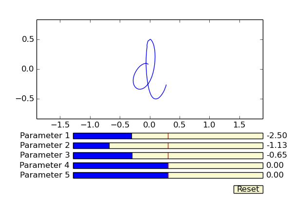
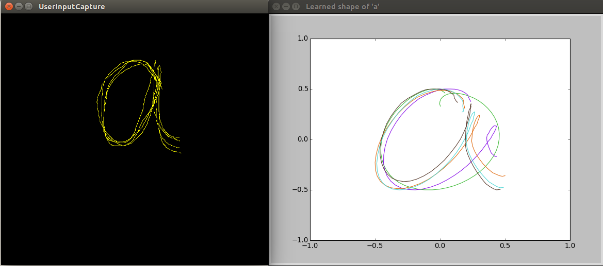
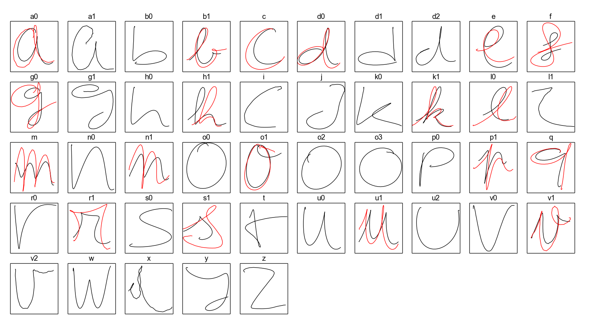

`shape_learning` is a library for simultaneously learning multiple shape models
based on user input, such as demonstrations.

Initial models for over 100 symbols (mostly letters) [are
provided](https://github.com/chili-epfl/shape_learning/tree/master/share/letter_model_datasets/uji_pen_chars2).

Overview
========

Python dependencies:
```
enum, scipy, recordtype
```

Shape modelling
---------------

The `ShapeModeler` class manages a model of a particular shape, for example a
letter. The current implementation uses a principle component analysis-based
model: it takes a dataset of instances of the shape and determines the
parameters which explain the majority of variance in the dataset. 


A GUI to visualise the effect of varying parameters of the shape model is
provided in `scripts/shape_model_gui.py`.  Sample usage:

```
./scripts/shape_model_gui.py 'd' 5
```

*An example of the GUI for visualising the effects of the model of 'd'.*

A set of principle components parameters for a set of shapes can be conveniently
generated and saved with:

```
./scripts/generate_custom_parametrization.py <regexp to select shapes in dataset>
```

Shape learning
--------------

The `ShapeLearner` class manages the learning of the parameters of a particular
`ShapeModeler` attribute. The parameters of user-demonstrated shapes may be
determined from the model, and used to update the learned parameters of the
system.

The `ShapeLearnerManager` class manages collections of multiple `ShapeLearner`s.
For example, in the context of learning words, the `ShapeLearnerManager` keeps
track of the current word being learnt and its associated `ShapeLearner`s, in
addition to the information on each letter/word which has been previously seen.
This allows for long-term system memory, even when the shapes are not always
part of the active collection.

A sample application of learning words is provided in
`scripts/learning_letters.py` (additional dependency of Kivy). The default
dataset of letter instances is from the UJI pen charaters 2 dataset. Sample
usage:

```
./scripts/learning_letters.py 'case'
```


*An example of the app for demonstrating the letter 'a' (left) to update the system-learned shape (right, originally 'o'-shaped).*

For a more complex use case of the `shape_learning` library, see [the CoWriter
project](https://github.com/chili-epfl/cowriter_letter_learning).

Dataset vizualisation
=====================

The current dataset of shape (or a subset thereof) can be vizualised with:

```
./scripts/vizualise_dataset.py <regex>
```

For instance:

```
./scripts/vizualise_dataset.py "[a-z]"
```

A set of predefined principle components values can be provided (with
`--parameters`) and the resulting shapes while be overlaid one the default mean
shapes:



Dataset processing
==================

Scripts are provided to generate the datasets for letters (and many other
symbols like numbers) from the [UJI Pen Char
2](https://archive.ics.uci.edu/ml/datasets/UJI+Pen+Characters+%28Version+2%29)
database.

Run:

```
python ./tools/dataset-preprocessing/parseDataset.py <path to ujipenchar2.txt> <dest path>
```

to parse, interpolate, normalize, and cluster the letters present in the
database.
